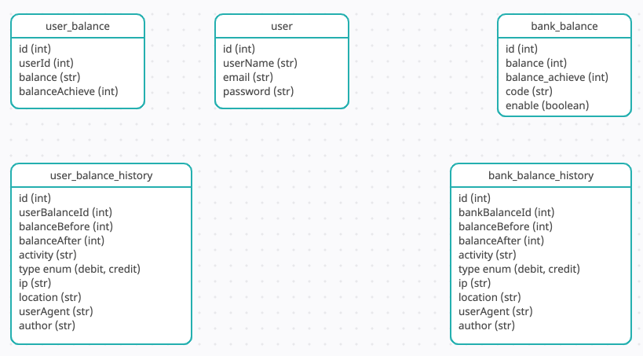

## E-wallet using the following stacks:
- Java Spring Boot
- Spring Web MVC for the web layer
- MySQL on Docker for database
- Hibernate to initialize database schema
- Flyway to populate the initialized schema
- Thymeleaf for the template engine 
- HTML 5 and Bootstrap 4 for responsive user interface
- Spring Security for authentication

## Users can do the following with the e-wallet application:
- Registration
- Login
- Logout
- Top up 
- Transfer

## Before running the app:
- Set up your MySQL database on http://localhost:3306/ named `demo`
- Config the database by following `application.properties`

## How to run the app: 
Go to `ewallet.java` and click the green triangle button next to the `ewallet` class

## User flow
- todo

## Database

## Existing logic errors:
- When the table `user` is truncated and the spring boot app is restarted, if the browser caches the most recent login session, the recent user would still be logged in after the restart and would be able to access topup and transfer page
- There is still error when sender transfers to receiver when receiver's balance is 0
- User can top up their account using other people's account
- User can access the endpoint `/topup?success` from browser

## Next iteration:
- Use Spring JWT for authentication
- Dockerize the whole Spring Boot application
- Use Swagger to generate documentation
- Use Spring Data JPA model to generate ERD
- Use React/Angular for the frontend instead of only HTML
- Deploy to AWS infrastructure
